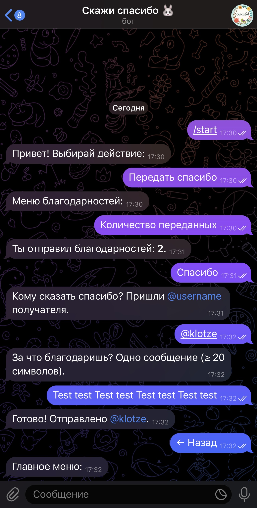

# Kudos Bot

Kudos Bot — это Telegram-бот на **Swift (Vapor)** для отправки благодарностей коллегам и выгрузки их в CSV.

## Скриншоты

<div align="center">
  
  &nbsp;&nbsp;
  
</div>

## Возможности
- Отправка благодарностей коллеге через команду `/thanks @username причина`.
- Экспорт всех благодарностей в формате CSV через `/export`.
- Хранение данных в SQLite.
- Лёгкий деплой через Docker + Docker Compose.


## Стек технологий
- [Swift 5.10](https://swift.org)
- [Vapor 4](https://vapor.codes)
- SQLite (через Fluent)
- Docker & Docker Compose

## Данные и выгрузки
- База данных (kudos.sqlite) хранится в отдельном volume (kudos_db).
- Экспортированные CSV-файлы сохраняются в папке exports/ на хосте.

---

## Быстрый старт (локально)

**Требования**: Xcode 15+/Swift 5.10, Docker Desktop (для контейнеров).
  
### Запуск без Docker
```bash
swift run Run
```
Сервер поднимется на `http://127.0.0.1:8080` (см. логи Vapor).
  
### Запуск в Docker (dev)
```bash
docker compose up --build -d
docker compose logs -f
```

## Продакшен через Docker Hub + GitHub Actions (CI/CD)

Пайплайн:
1. `git push` в ветку `main`;
2. GitHub Actions собирает Docker‑образ и пушит в Docker Hub: `helsinki253/kudos-bot:latest`;
3. Тот же workflow по SSH заходит на VPS и выполняет `docker compose pull && up -d`.

### Что подготовить один раз

**На VPS (Ubuntu 22/24):**
```bash
# Docker + Compose plugin
sudo apt-get update
sudo apt-get install -y ca-certificates curl gnupg
sudo install -m 0755 -d /etc/apt/keyrings
curl -fsSL https://download.docker.com/linux/ubuntu/gpg | sudo gpg --dearmor -o /etc/apt/keyrings/docker.gpg
echo "deb [arch=$(dpkg --print-architecture) signed-by=/etc/apt/keyrings/docker.gpg] https://download.docker.com/linux/ubuntu \
$(. /etc/os-release && echo "$VERSION_CODENAME") stable" | sudo tee /etc/apt/sources.list.d/docker.list > /dev/null
sudo apt-get update
sudo apt-get install -y docker-ce docker-ce-cli containerd.io docker-buildx-plugin docker-compose-plugin

# Папка приложения + переменные окружения
sudo mkdir -p /apps/kudos-bot && cd /apps/kudos-bot
sudo nano .env     # добавить BOT_TOKEN=... и другие переменные (см. ниже)
sudo chmod 600 .env
```

**Secrets в GitHub (Settings → Secrets and variables → Actions):**
- `DOCKERHUB_USERNAME` — `helsinki253`
- `DOCKERHUB_TOKEN` — персональный токен Docker Hub (Read & Write)
- `VPS_HOST` — IP или хостнейм VPS
- `VPS_USER` — пользователь SSH (например, `root`)
- `VPS_SSH_KEY` — содержимое приватного SSH‑ключа (OpenSSH, BEGIN/END)

### Переменные окружения (.env)

Обязательные:
```env
BOT_TOKEN=xxxxxxxxxxxxxxxxxxxxxxxxxxxxxxxxxxxx
```

Опциональные (пример):
```env
LOG_LEVEL=info
STORAGE_DIR=/exports
```

### Что делает workflow

Файл: `.github/workflows/deploy.yml`  
- Сборка Docker образа (с кэшем слоёв через GitHub Actions Cache);
- Пуш в Docker Hub (`latest` и тег коммита);
- SSH на VPS + запуск/обновление Compose в `/apps/kudos-bot/docker-compose.prod.yml`.

### Ручная проверка на VPS

```bash
cd /apps/kudos-bot
docker compose -f docker-compose.prod.yml ps
docker compose -f docker-compose.prod.yml logs --tail 200
```

### Роллбек версии

В логе Actions виден тег образа с SHA. На VPS:
```bash
docker pull helsinki253/kudos-bot:<SHA>
# при необходимости изменить image: в docker-compose.prod.yml на точный тег
docker compose -f docker-compose.prod.yml up -d
```

## Тонкости и советы

- **`Package.resolved` в репозитории** — фиксирует версии зависимостей и ускоряет сборку в CI.
- **Healthcheck**: по умолчанию бьёт в `http://127.0.0.1:8080/health`. Если у рантайм-образа нет `curl` или у приложения нет эндпоинта, либо добавьте `curl` в образ, либо замените healthcheck на процессный, либо уберите блок `healthcheck`.
- **Безопасность токенов**: не коммить `.env`. Все секреты — только в GitHub Secrets / на VPS.
- **SSH-ключи**: для CI удобен отдельный deploy‑ключ без passphrase. Публичную часть добавьте в `~/.ssh/authorized_keys` на VPS, приватную — в `VPS_SSH_KEY`.

## Частые проблемы

- **`manifest for ...:latest not found`** — образ ещё не запушен в Docker Hub; дождитесь зелёного `build-and-push`.
- **`ERROR: /apps/kudos-bot/.env is missing`** — создайте `/apps/kudos-bot/.env` на VPS.
- **`Permission denied (publickey)`** — проверьте `VPS_SSH_KEY` (полный приватный ключ) и соответствующую `.pub` в `authorized_keys`.
- **`curl: not found` в healthcheck** — добавьте `curl` в runtime‑образ или отключите healthcheck.
- **Падает сборка на `Package.resolved`** — либо закоммить `Package.resolved`, либо уберите его из `Dockerfile` и пинуте версии в `Package.swift`.

## Структура данных и экспорт

- SQLite база хранится в volume `kudos_db` (смонтирована в контейнер по пути `/data`).
- Экспортированные CSV складываются на хосте в `/apps/kudos-bot/exports` (том примонтирован как `./exports:/exports`).

---
