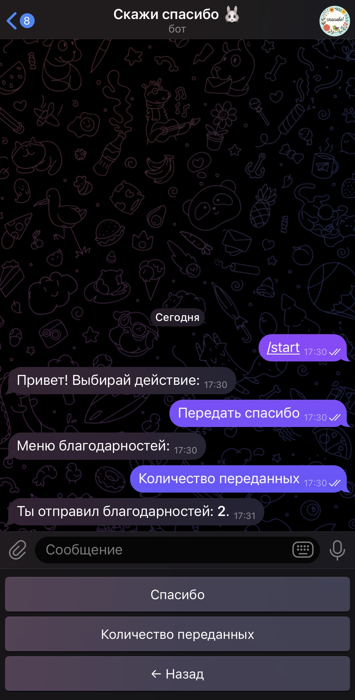

# Kudos Bot

Kudos Bot — это Telegram-бот на **Swift (Vapor)**, построенный по модульной архитектуре с кастомным стартовым меню.  
Каждая кнопка в меню — это отдельная фича (например, «Благодарности»), и проект легко расширяется новыми модулями.  

Первая реализованная фича — **Kudos (Благодарности)**: можно отправлять благодарности коллегам, считать статистику и выгружать всё в CSV.  
В дальнейшем планируется добавление новых функций (списки сотрудников, справочные разделы и др.).

Проект разворачивается через Docker и включает CI/CD пайплайн.

## Оглавление
- [Kudos Bot](#kudos-bot)
  - [Возможности](#возможности)
  - [Стек технологий](#стек-технологий)
  - [Данные и выгрузки](#данные-и-выгрузки)
  - [Быстрый старт (локально)](#быстрый-старт-локально)
  - [Продакшен через Docker Hub + GitHub Actions (CI/CD)](#продакшен-через-docker-hub--github-actions-cicd)
    - [Что подготовить один раз](#что-подготовить-один-раз)
    - [Переменные окружения (env)](#переменные-окружения-env)
    - [Что делает workflow](#что-делает-workflow)
    - [Ручная проверка на VPS](#ручная-проверка-на-vps)
    - [Роллбек версии](#роллбек-версии)
  - [Структура данных и экспорт](#структура-данных-и-экспорт)
  - [Архитектура проекта](#архитектура-проекта)
  - [Планы развития](#планы-развития)


## Скриншоты

<div align="center">
  
  &nbsp;&nbsp;
  
</div>

## Возможности
- `/start` — приветственное меню с кнопками (без ввода команд вручную).
- «Передать спасибо» — пошаговый сценарий:
  - выбрать коллегу (@username),
  - указать причину (≥ 20 символов),
  - сохранить благодарность в базе.
- «Количество переданных» — статистика по отправленным благодарностям.
- «Экспорт CSV» — выгрузка всех благодарностей (только для админов).
- Хранение данных в PostgreSQL.
- Деплой через Docker + Docker Compose.
- Полностью работает в Telegram-чате, без веб-интерфейса.


## Стек технологий
- [Swift 5.10](https://swift.org)
- [Vapor 4](https://vapor.codes)
- Fluent ORM (с драйвером PostgreSQL)
- Docker & Docker Compose
- GitHub Actions (CI/CD)

## Данные и выгрузки
- Данные хранятся в PostgreSQL (сервис `db` = database в Docker Compose).
- Экспортированные CSV-файлы сохраняются в папке exports/ на хосте.

---

## Быстрый старт (локально)

**Требования**: Xcode 15+/Swift 5.10, Docker Desktop (для контейнеров).
  
### Запуск в Docker
```bash
docker compose up --build -d
docker compose logs -f
```

## Продакшен через Docker Hub + GitHub Actions (CI/CD)

Пайплайн:
1. `git push` в ветку `main`;
2. GitHub Actions собирает Docker‑образ и пушит в Docker Hub: `helsinki253/kudos-bot:latest`;
3. Тот же workflow по SSH заходит на VPS и выполняет `docker compose pull && up -d`.

### Что подготовить один раз

**На VPS (Ubuntu 22/24):**
```bash
# Docker + Compose plugin
sudo apt-get update
sudo apt-get install -y ca-certificates curl gnupg
sudo install -m 0755 -d /etc/apt/keyrings
curl -fsSL https://download.docker.com/linux/ubuntu/gpg | sudo gpg --dearmor -o /etc/apt/keyrings/docker.gpg
echo "deb [arch=$(dpkg --print-architecture) signed-by=/etc/apt/keyrings/docker.gpg] https://download.docker.com/linux/ubuntu \
$(. /etc/os-release && echo "$VERSION_CODENAME") stable" | sudo tee /etc/apt/sources.list.d/docker.list > /dev/null
sudo apt-get update
sudo apt-get install -y docker-ce docker-ce-cli containerd.io docker-buildx-plugin docker-compose-plugin

# Папка приложения + переменные окружения
sudo mkdir -p /apps/kudos-bot && cd /apps/kudos-bot
sudo nano .env     # добавить BOT_TOKEN=... и другие переменные (см. ниже)
sudo chmod 600 .env
```

**Secrets в GitHub (Settings → Secrets and variables → Actions):**
- `DOCKERHUB_USERNAME` — `helsinki253`
- `DOCKERHUB_TOKEN` — персональный токен Docker Hub (Read & Write)
- `VPS_HOST` — IP или хостнейм VPS
- `VPS_USER` — пользователь SSH (например, `root`)
- `VPS_SSH_KEY` — содержимое приватного SSH‑ключа (OpenSSH, BEGIN/END)

### Переменные окружения (.env)

Создайте файл `.env` со всеми необходимыми переменными:
```env
# Токен Telegram-бота
BOT_TOKEN=xxxxxxxxxxxxxxxxxxxxxxxxxxxxxxxxxxxx

# База данных (локально через Docker Compose)
POSTGRES_DB=kudos
POSTGRES_USER=postgres
POSTGRES_PASSWORD=postgres
POSTGRES_HOST=db
POSTGRES_PORT=5432
DATABASE_URL=postgresql://${POSTGRES_USER}:${POSTGRES_PASSWORD}@${POSTGRES_HOST}:${POSTGRES_PORT}/${POSTGRES_DB}?sslmode=disable

# Дополнительно
LOG_LEVEL=info
STORAGE_DIR=/exports
```

В переменной `ADMIN_IDS` нужно вручную указать список Telegram userId администраторов (через запятую), иначе кнопка «Экспорт CSV» не будет доступна.

Пример:
```
ADMIN_IDS=61087823,123456789
```

### Что делает workflow

Файл: `.github/workflows/deploy.yml`  
- Сборка Docker образа (с кэшем слоёв через GitHub Actions Cache);
- Пуш в Docker Hub (`latest` и тег коммита);
- SSH на VPS + запуск/обновление Compose в `/apps/kudos-bot/docker-compose.prod.yml`.

### Ручная проверка на VPS

```bash
cd /apps/kudos-bot
docker compose -f docker-compose.prod.yml ps
docker compose -f docker-compose.prod.yml logs --tail 200
```

### Роллбек версии
Если после деплоя что-то сломалось, можно откатиться на предыдущий рабочий образ:

1. Найдите в [GitHub Actions](../../actions) номер коммита (SHA), для которого собирался Docker-образ.
2. На VPS подтяните нужный образ:
   ```bash
   docker pull helsinki253/kudos-bot:<SHA>
   ```
   
3. В docker-compose.prod.yml укажите этот тег:
   ```
   image: helsinki253/kudos-bot:<SHA>
   ```
   
4. Примените изменения:
   ```
   docker compose -f docker-compose.prod.yml up -d
   ```


## Структура данных и экспорт

- PostgreSQL база поднимается как сервис db и использует volume для хранения данных (pgdata).
- Экспортированные CSV складываются на хосте в `/apps/kudos-bot/exports` (том примонтирован как `./exports:/exports`).

---

## Архитектура проекта

Проект организован по feature-folder структуре, где каждый функциональный модуль содержит свои модели, контроллеры и сервисы. Это упрощает поддержку и масштабирование приложения.

Пример структуры папок:

```
Sources/
├── App/                       // Корневая папка серверного приложения
│   ├── Core/                  // Базовые сервисы и общая инфраструктура
│   │   ├── BotController.swift    // Роутинг апдейтов Telegram → делегирует в фичи
│   │   ├── TelegramService.swift  // Транспорт: poll, sendMessage, sendDocument
│   │   ├── SessionStore.swift     // Хранилище состояний диалогов (in-memory)
│   │   ├── CSVExporter.swift      // Утилита экспорта данных в CSV
│   │   └── DTO.swift              // Общие Data Transfer Objects (модели Telegram API и др.)
│   │
│   ├── Features/              // Основные фичи (доменные модули)
│   │   ├── BotMenu/               // Фича “Меню бота” (навигация и кнопки)
│   │   │   ├── Controllers/          // BotMenuController.swift — логика экранов и кнопок
│   │   │   └── Services/             // KeyboardBuilder.swift — генерация клавиатур
│   │   │
│   │   └── Kudos/                 // Фича “Благодарности”
│   │       ├── Models/               // KudosModel.swift — модель данных Fluent
│   │       ├── Controllers/          // KudosController.swift — HTTP/бот-ручки для работы с благами.
│   │       └── Services/             // Логика домена (экспорт CSV, подсчёты)
│   │
│   └── Run/                    // Точка входа приложения
│       └── Main.swift             // Запуск сервера Vapor
```

## Синхронизация docker-compose

Рекомендуется держать локальный `docker-compose.yml` и продовый `docker-compose.prod.yml` максимально одинаковыми по сервисам (`db` и `kudos-bot`).  
Различаться могут только настройки окружения (например, проброс портов, политика рестартов, пути к volume).  

Это позволит избежать ситуации, когда проект работает локально, но ломается на VPS из-за расхождения конфигураций.

## HTTP эндпоинты

- `GET /health` — проверка статуса сервера, возвращает HTTP 200 OK, используется для healthcheck контейнера.

## Планы развития (TODO)

- Улучшить логирование и мониторинг приложения.
- Расширить функционал команд бота.

---

